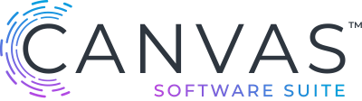

# Lyra24 Canvas Software Suite Firmware
The Lyra24 Canvas Software Suite firmware is designed to get you up and developing embedded applications quickly on and Lyra24 module using Python to operate its Bluetooth Low Energy (BLE) radio and other facilities. Hardware functionality is accessible via Python APIs and can be customized to meet the needs of the product integrating the Lyra24 module. Python support is based on the [MicroPython] engine.
This firmware is distributed as a `.hex` file for use with programming tools such as `Simplicity Studio Flash Programmer` to program the internal flash of the Lyra24 module. The `.gbl` files included in the release package can be used to perform OTA firmware update via the Silabs EFR Connect application for Android and iOS or via USART. Details for flashing the different image types can be found in the [Firmware options and upgrade guide] application note.

This firmware is a part of the <strong>Canvas Software Suite</strong> platform providing firmware, tools, documentation and sample applications to simplify software development on Laird Connectivity wireless products.
For more information about Canvas Software Suite see [Canvas Software Suite].
If you would like to develop on the Lyra24 module directly with the Silabs Gecko SDK, please contact [Laird Connectivity support] for assistance.

The Lyra24 Canvas Software Suite is available in the following different variants:
1. [P10 (PCB module, 10dBm output power)][Lyra24 P series datasheet],
2. [S10 (SIP module, 10dBm output power)][Lyra24 S series datasheet],
3. [P20 (PCB module, 20dBm output power)][Lyra24 P series datasheet],
4. [P20RF (PCB module, 20dBm output power with RF trace pad)][Lyra24 P series datasheet],
5. [USB Dongle (based on the PCB module with 20dBm output power)][Lyra24 P series datasheet].

# Content

All firmware is offered in P10, S10, P20 and P20RF versions, depending upon the Lyra24 variant in use.

## Bootloader

The Bootloader is required for operation of all applications and should be the first application programmed to the target device.

Further details of usage of the bootloader can be found in the [Firmware options and upgrade guide][Firmware options and upgrade guide].

|   Bootloader Type  | Lyra24 P10 BOOT Pin | Lyra24 S10 BOOT Pin | Lyra24 P20 BOOT Pin | Lyra24 PRF BOOT Pin |
|--------------------|---------------------|---------------------|---------------------|---------------------|
| Laird Connectivity |        PC07         |        PC07         |        PC07         |        PC07         |

Binaries are available for transfer using SWD only. Please note that by default all Lyra24 modules ship with the Laird Connectivity bootloader type preprogrammed.

Bootloaders can be found in the [Lyra24 Firmware] repository under the apropriate release.

## Accessing Python on the Lyra24 Module

To access the Python REPL, open a terminal to the Python REPL Console serial port that appears after you’ve programmed the Canvas Firmware onto your Lyra24 DVK using `pyocd` above. The terminal should display a `>>>` prompt when you press the ENTER key.
From this prompt, you can type Python statements and interact with the DVK hardware directly. For more information on general APIs available from MicroPython, please refer to the [MicroPython] page. Note that not all libraries are supported by the Lyra24 but this will still serve as a good reference for many common built-in functions and provide a good overview of MicroPython functionality.
For hardware-specific APIs pertaining to the Lyra24 board specifically, please refer to the [Canvas Python API Documentation] page.
The REPL interface via serial port is the primary interface used by Canvas tools to load/save Python scripts onto the Lyra24 module.

## Developing Python Scripts on the Lyra24 Module

### The Xbit VS Code Extension

As part of Canvas Software Suite, we’ve developed the Xbit VS Code extension designed to make it easy to interface with compatible hardware such as the Lyra24 DVK from a familiar code editing environment ([VS Code]). To get started, open the Extensions tab within VS Code, search for Xbit and install the **Xbit tools for VS Code** extension.

_Xbit Sidebar Menu Icon_

Once the Xbit VSC extension (Xbit VSC) is installed, the above icon will appear in the sidebar menu of VS Code where you can access USB devices running compatible Canvas Firmware. With the Lyra24 DVK attached to your workstation, clicking on the icon for Xbit VSC will display an entry in the USB DEVICES panel corresponding to each attached board with an `>>>` icon next to it indicating the detected serial port is running a Python REPL and is ready to go.

### Listing Python Scripts on the Lyra24

Once the Lyra24 DVK is listed in the USB DEVICES panel of Xbit VSC, click the device name for the board you’d like to interact with. For example, the Lyra24 board should be listed as the serial port identifier on your workstation. Clicking this will open the REPL serial port and expand the tree item in the panel to list the files available on the Lyra24’s internal filesystem. If you’ve never programmed any Python scripts on the module before, this list will be empty. Note the `>>>` icon turns blue while the REPL serial port is open, making it easy to see when the port is active within Xbit VSC. To disconnect from the board, use the **Disconnect** button in the SELECTED DEVICE panel below the USB DEVICES panel. This will also close any corresponding Terminal windows open to the device and collapse the tree view item for the board in the USB DEVICES panel.

### Creating a Python Script on the Lyra24

To create a new file on the Lyra24’s internal filesystem, right-click the device in the USB DEVICES panel and select <strong>Create File</strong>. Type the name of the file you’d like to create, e.g. `test.py` and press ENTER. After a few seconds, the new file will appear in the tree view under the device in the USB DEVICES panel. Click on the file to open an editor within VS Code. Here you can enter a Python script that you’d like to save onto the device. When editing is finished, selecting `File->Save` or (`Ctrl+S` or `Cmd+S` depending on your platform) will save the file back to the Lyra24’s filesystem.
To rename a file, right-click on the filename in the USB DEVICES panel and select <strong>Rename File</strong>.
To delete a file from the Lyra24’s filesystem, right-click the file and select <strong>Delete File</strong>.
To refresh an editor pane from content in the Lyra24’s filesystem, right-click and select <strong>Refresh</strong>.

### Drag and Drop Support

If you have a Python file already in your workstation’s filesystem and would like to just copy it to the device, Xbit VSC does support drag and drop of files directly onto the USB DEVICES panel to trigger a copy to the Lyra24’s filesystem. From your system’s file explorer/finder, click and drag one or more `.py` files onto the tree view item for the corresponding DVK board you’d like to copy files to, then release to start the copy.

### Accessing the REPL Terminal

When an attached device is selected in the USB DEVICES panel of Xbit VSC, the REPL port is automatically opened and a new TERMINAL window is displayed typically near the bottom of the VS Code window. You can type in this terminal just as you would with any serial terminal attached to the REPL serial port to interact with the board directly via Python statements. This is also where output from the Python scripts will appear if you use `print()` or similar output functions from within your scripts.

## Running a Python Script

The Canvas Firmware interprets files named `boot.py` and `main.py` in a special way. If a file named `boot.py` exists in the Lyra24’s filesystem, the Python engine will run this script after a RESET. If `main.py` exists, it will then run this script after running the `boot.py` script. This allows controlled sequencing of Python code to be executed after power-on of the Lyra24 module.
To test out a Python script on the Lyra24 module, simply rename the script you’ve saved using Xbit VSC to `boot.py` or `main.py` and restart the board. If you find the code is stuck in a tight loop or is not doing what you expect and need to interrupt it, connect to the board from Xbit VSC, select the board in the USB DEVICES panel and press the **Break** button in the SELECTED DEVICE panel below. You can also type `Ctrl+C` in the Terminal panel for the corresponding device.
To trigger a reset of the board from Xbit VSC, press the **Reset** button in the SELECTED DEVICE panel. You can also type `Ctrl+D` in the Terminal panel for the corresponding device.

## Next Steps

To make it easier to understand how to use Python to create your application scripts for the Lyra24, a library of sample application scripts will be provided demonstrating many of the common use cases for the hardware. To see the latest list of available sample applications, visit [Canvas Software Suite] and navigate to the **Sample Applications** section. The library of samples will be updated over time, so if you don’t see something you are looking for, feel free to reach out to [Laird Connectivity support] with any questions!

[Lyra24 P series datasheet]: <https://www.lairdconnect.com/documentation/datasheet-lyra-24p>
[Lyra24 S series datasheet]: <https://www.lairdconnect.com/documentation/datasheet-lyra-24s>
[Firmware options and upgrade guide]: <https://www.lairdconnect.com/documentation/user-guide-firmware-options-and-upgrading-lyra-series>
[Native C development guide]: <https://www.lairdconnect.com/documentation/user-guide-lyra-series-c-code-development>
[MicroPython]: <https://github.com/micropython/micropython>
[Canvas Software Suite]: <https://www.lairdconnect.com/canvas>
[Laird Connectivity support]: <https://www.lairdconnect.com/resources/support>
[Canvas Python API Documentation]: <https://lairdcp.github.io/canvas_python_docs>
[VS Code]: <https://code.visualstudio.com/download>
[Lyra24 Firmware]: <https://github.com/LairdCP/Lyra_24_Firmware>
